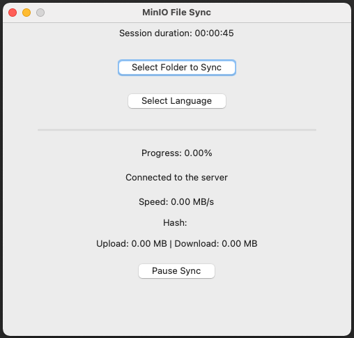

# MinIO File Sync

## Description

MinIO File Sync is a macOS application that enables automatic file synchronization between a local directory and a MinIO server.
It provides a graphical interface to manage synchronization and monitor status. 
The application also includes file hash verification to ensure data integrity during transfers.

## Features

- **Automatic Synchronization:** Real-time monitoring of a local directory and file synchronization with MinIO.
- **File Hash Verification:** Ensures data integrity by verifying the file hash before and after transfer.
- **GUI Management:** Select the folder to sync, view status, and control synchronization through a graphical interface.
- **Notifications and Logging:** Desktop notifications for important events and detailed logging of actions.

## Requirements

- **A configured MinIO server.**
- **macOS**: This application is designed to run on macOS.
- **Python 3.7+**: Ensure you have Python 3 installed before running the application.
- Python Libraries:
  - `boto3`
  - `watchdog`
  - `pystray`
  - `Pillow`

## Configuration

Modify the config.json file to set the following parameters:

    MINIO_ENDPOINT: The endpoint of the MinIO server.
    MINIO_ACCESS_KEY: The access key for MinIO.
    MINIO_SECRET_KEY: The secret key for MinIO.
    MINIO_BUCKET: The name of the bucket to sync.
    CHECK_INTERVAL: The interval time (in seconds) between each sync check.

## Notes

Version 1.0: This is the first version of MinIO File Sync. 
Please note that there may be bugs, and improvements are planned for future updates. 
Feedback and bug reports are highly appreciated.

## Contribution

Contributions are welcome! Feel free to open an issue or submit a pull request.

